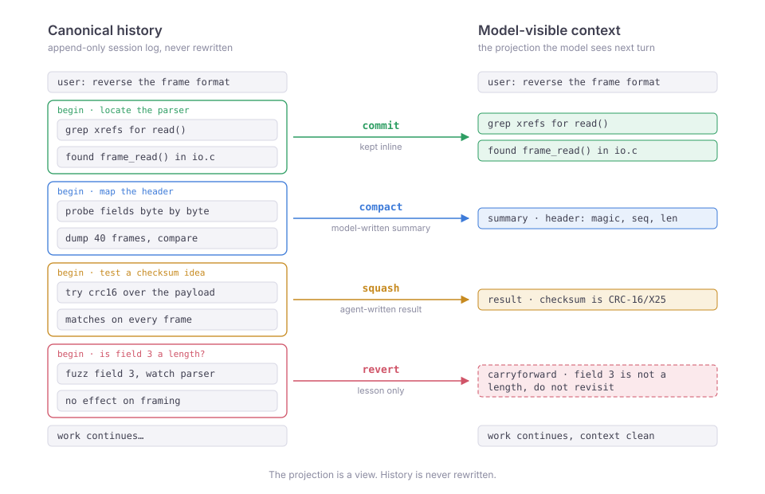

# pi-memento

Explicit, nested transactions over an agent's own model-visible conversation context: commit, compact, squash, or revert a stretch of exploration without ever rewriting session history.

pi-memento is an extension for pi, the `@earendil-works/pi-coding-agent` coding agent. It is experimental (v0.1.0) and MIT licensed.

<picture>
  <source media="(prefers-color-scheme: dark)" srcset="docs/assets/projection-dark.svg">
  
</picture>

## What it is

Spawning a subagent bundles two separable things:

- an **execution** axis: a separate agent loop, with its own isolation, its own model calls, and a spawn/return boundary that has to be decided up front; and
- a **context** axis: the caller's context keeps only the conclusion; the exploration that produced it is hidden.

Forking couples them. You can only get the context effect by also paying the execution cost, and you have to commit to the boundary before you know how the exploration will go.

pi-memento **decouples the context axis from execution and generalizes it.** It delivers the context effect alone, inside the same agent loop, and lifts the constraints a fork boundary imposes:

- **Any granularity, any point.** Wrap a single tool call or a hundred; open a transaction wherever the work starts getting speculative.
- **Reactive, not up-front.** Decide what to do with a stretch *after* seeing how it went: keep it, summarize it, replace it with a one-line result, or throw it away.
- **Nestable.** Isolate a sub-investigation inside a larger one; each closes independently.
- **A full-keep escape hatch (`commit`)** that a fork boundary cannot express: sometimes the exploration *is* the answer and you want all of it inline.

The two approaches compose rather than compete: subagents partition work across new contexts; pi-memento grooms the memory of a single context, and a subagent can use pi-memento internally.

This is the primitive a long-horizon agent needs, at any depth of a task tree, to keep its working memory clean while doing unpredictable, findings-compound work. Reverse-engineering a protocol is the canonical case: chase many hypotheses inline, keep the one that panned out, squash the rest to their conclusions, and revert the dead ends down to the lesson they taught.

## The model

The extension registers three tools:

```
transaction_begin({ purpose? })
transaction_end({ disposition, result?, carryforward? })
transaction_status()
```

`transaction_begin` and `transaction_end` must each be the **only** tool call in their assistant message (an exclusive boundary). `transaction_end` always closes the **innermost** open transaction (LIFO); transactions nest. `transaction_status` is read-only and reports the currently open stack.

`transaction_end` takes one of four dispositions, each defining what happens to the transaction body in the projected context:

| Disposition | Effect on projected context | Notes |
|---|---|---|
| `commit`  | Keeps the body inline, as if no transaction had wrapped it. | No `result`/`carryforward`. |
| `compact` | Replaces the body with a summary the extension **generates via a model call**. | The only disposition that calls the model. Optional `carryforward`. |
| `squash`  | Replaces the body with an explicit `result` string the agent writes itself. | `result` required and non-empty; no model call. Optional `carryforward`. |
| `revert`  | Removes the body entirely. | **Requires** a non-empty `carryforward`, so a dead end still leaves its lesson. |

`carryforward` is a small durable lesson or instruction that survives the projection: the one thing you want to keep even when the exploration itself is compacted, squashed, or discarded.

## When to open a transaction

Open one when a block of work is likely to be noisy, exploratory, disposable, compressible, worth keeping only as a conclusion, or worth abandoning while retaining one lesson.

The property that matters is atomicity at the semantic level: this entire episode was one unit of thought; decide what representation of that episode should survive.

## Build & run

pi-memento is a plugin, not a vendored fork. It runs a project-local, pinned pi that is a separate binary from any globally installed `pi`; running it does not touch your global install.

```sh
npm install      # fetches pinned pi (@earendil-works/pi-coding-agent@0.84.3) into node_modules
npm run build    # compiles the extension to dist/
./bin/memento    # launches the pinned pi with the extension loaded
```

Optionally symlink the launcher onto your `PATH`:

```sh
ln -s "$PWD/bin/memento" ~/.local/bin/memento
```

Reproducibility comes from `package-lock.json`, and the pinned pi ships its own model catalog, so the build needs no network beyond `npm install`.

Development:

```sh
npm test
npm run check
npm run build
```

## Projection & compaction safety

A transaction only ever affects **conversational context**. The projection is a *view* over canonical history, which stays append-only (JSONL), so a transaction effect is never a rewrite of what happened.

It follows that a transaction **does not roll back the world.** Reverting, squashing, or compacting does not undo files written, commands run, or any other side effect. An open transaction is not a sandbox; never treat it as one for destructive or irreversible actions.

Compaction is transaction-aware. It moves cuts off transaction boundaries so no interval is bisected, keeps every open transaction entirely in the retained tail, and summarizes only the projected durable prefix. On inconsistent boundaries or metadata it **fails closed**, cancelling rather than falling back to raw history, so a later exact `commit`, `squash`, or `revert` can never be undermined by a summary that ignored the dispositions.

## Non-goals

pi-memento does not provide:

- filesystem, shell, or process rollback
- VM/container snapshots
- database transactions
- distributed agent memory, shared facts between agents, or voting/consensus
- semantic search across history
- automatic long-term memory management

The project is strictly about transactional control over a single agent's conversational context.

## Status

Experimental (v0.1). Pinned to pi `@earendil-works/pi-coding-agent` 0.84.x.

See [docs/pi-contract.md](./docs/pi-contract.md) for the integration contract with pi.

## License

MIT
